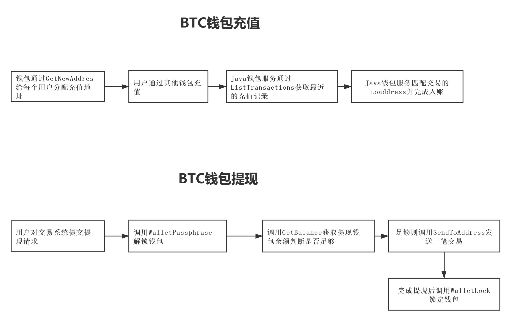

> 交易系统与钱包之间的对接的本质就是交易系统通过RPC等方式同步钱包之中的数据

### BTC系列钱包对接

#### 部署BTC钱包节点
1. 下载BTC Linux钱包并解压：[https://bitcoin.org/zh_CN/download](https://bitcoin.org/zh_CN/download)
2. 创建区块同步的文件夹blockData: `mkdir blockData`
3. 启动服务：`./bin/bitcoind -datadir=/home/blockData -server=1 -rpcuser=btc -rpcpassword=123456 -rpcport=10086 -rpcallowip=0.0.0.0/0`
4. 测试网添加参数`-testnet`，生产环境则默认不加。
5. 钱包运行需要打开防火墙，保证`10086`端口Java钱包服务可以访问到，云服务器需要在安全组进行配置，最安全的策略是在内网访问，不对外开放。

#### 钱包安全备份
1. 比特币默认创建的目录在`~/.bitcoin/`下，其中的`wallet.dat`则是钱包文件，这个是可以控制当前账户下所有比特币的文件
2. 只需要对`wallet.dat`文件进行复制备份就OK，比较好的办法是对其进行文件加密并保存到一个安全的地方

#### 钱包API
> 官方API文档：https://bitcoin.org/en/developer-reference#rpc-quick-reference

1. GetBalance：返回总共的可用余额
2. GetNewAddress：返回一个新的比特币地址以接收付款
3. ListTransactions：获取最近的交易列表
4. GetTransaction：根据txid获取交易详细信息
5. SendToAddress：向指定的比特币地址发送比特币
6. WalletLock：锁定钱包
7. WalletPassphrase：解锁钱包

#### 钱包API与交易系统交互

